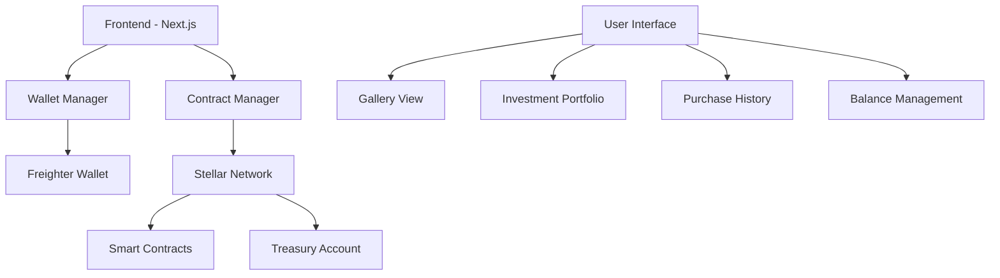

# 🎨 TokenArt - Stellar Blockchain-Based Art Investment Platform

TokenArt is an innovative platform running on the Stellar blockchain network that enables digital investment in artworks. Users can fractionally purchase, invest in, and own art pieces.

## 🏆 Team Members

- **Beyzanur Keskin** 
- **Merve Altınışık** 
- **Ayşegül Kervan** 


## 🚀 Project Features

### ✨ Core Features
- 🎯 **Fractional Art Investment**: Purchase shares of artworks
- 💰 **Stellar Blockchain Integration**: Secure and fast transactions
- 🔐 **Freighter Wallet Support**: Easy wallet connection
- 📊 **Real-time Portfolio Tracking**: View your investments instantly
- 🛒 **Full Ownership**: Purchase 100% funded artworks completely
- 📈 **Return Tracking**: Monitor your investment performance

### 🛠️ Technical Features
- **Frontend**: Next.js 15, React, TypeScript, Tailwind CSS
- **Blockchain**: Stellar Network (Testnet)
- **Wallet**: Freighter Wallet API
- **Smart Contracts**: Rust + Soroban
- **Database**: LocalStorage (Demo), Firebase (Production Ready)

## 🏗️ System Architecture



## 📦 Installation

### Prerequisites
- Node.js 18+ 
- npm or yarn
- Freighter Wallet browser extension
- Stellar Testnet account

### 1. Clone the Project
```bash
git clone https://github.com/beyzanrkeskinnn/tokenArt
cd artwork-investment
```

### 2. Install Dependencies
```bash
npm install
# or
yarn install
```

### 3. Create Treasury Account
```bash
# Generate treasury keypair
node generate-treasury.js

# Send testnet XLM to treasury account
node fund-treasury.js
```

### 4. Start Development Server
```bash
npm run dev
# or
yarn dev
```

The application will run at `http://localhost:3000`.

## 🎮 Usage Guide

### 1. Wallet Connection
1. Install Freighter Wallet extension
2. Create your testnet account
3. Click "Connect Wallet" button on main page
4. Confirm connection in Freighter

### 2. Making Investments
1. Select desired artwork from **Gallery** tab
2. Enter investment amount (minimum 1 XLM)
3. Click "Invest Now" button
4. Confirm transaction in Freighter

### 3. Portfolio Management
- **My Investments**: View your current investments
- **My Sales**: Track your sales history
- **My Purchases**: View artworks you own

### 4. Full Purchase
- 100% funded artworks become available for purchase
- You can make full purchases from "My Purchases" tab

## 📁 Project Structure

```
artwork-investment/
├── src/
│   ├── app/                    # Next.js App Router
│   │   ├── page.tsx           # Main page
│   │   ├── main/              # Main platform page
│   │   ├── artwork/           # Artwork detail pages
│   │   └── globals.css        # Global styles
│   ├── components/            # React components
│   │   ├── ErrorDisplay.tsx   # Error display
│   │   └── TransactionStatus.tsx # Transaction status
│   ├── lib/                   # Core libraries
│   │   ├── wallet.ts          # Wallet management
│   │   ├── contract.ts        # Smart contract interaction
│   │   ├── types.ts           # TypeScript types
│   │   └── simple-balance.ts  # Balance querying
│   └── utils/
│       └── debug.js           # Debug tools
├── public/                    # Static files
├── generate-treasury.js       # Treasury account generator
├── fund-treasury.js          # Treasury funding script
└── package.json              # Project dependencies
```

## 🔧 Configuration

### Treasury Settings
```typescript
// src/lib/contract.ts
const TREASURY_ADDRESS = 'GDL3VFUZE65BUWBVRHJUJZN7O33XXPBUZA3CA6747FCGYHHCSSZXK336';
```

### Stellar Network Settings
```typescript
const HORIZON_SERVERS = [
  'https://horizon-testnet.stellar.org',
  'https://horizon-futurenet.stellar.org'
];
```

## 🧪 Testing

### Unit Tests
```bash
npm test
```

### Integration Tests
```bash
# Run test script
node test-fixes.js

# Test network connection
node test-network.js
```

### Manual Testing Steps
1. Test wallet connection
2. Test balance querying
3. Test investment transaction
4. Test portfolio display

## 🚀 Deployment

### Deploy to Vercel
```bash
# With Vercel CLI
vercel --prod

# or automatic deploy with GitHub
git push origin main
```

### Environment Variables
```env
NEXT_PUBLIC_STELLAR_NETWORK=testnet
NEXT_PUBLIC_TREASURY_ADDRESS=your_treasury_address
```

## 🐛 Known Issues and Solutions

### 1. Wallet Connection Issues
- **Issue**: Freighter connection failed
- **Solution**: Refresh browser, reinstall Freighter

### 2. Balance Display
- **Issue**: Balance not loading
- **Solution**: Fund your account with Friendbot

### 3. Transaction Errors
- **Issue**: 400 Bad Request errors
- **Solution**: Check transaction amount, try again

## 📊 Performance Metrics

- ⚡ **Page Load**: ~2 seconds
- 🔄 **Transaction Time**: ~5-10 seconds
- 💾 **Data Synchronization**: Real-time
- 🔒 **Security**: Stellar blockchain standards

## 🤝 Contributing

1. Fork the repository
2. Create feature branch (`git checkout -b feature/amazing-feature`)
3. Commit your changes (`git commit -m 'Add amazing feature'`)
4. Push to branch (`git push origin feature/amazing-feature`)
5. Open Pull Request

### Development Rules
- Use TypeScript types
- Follow ESLint rules
- Follow responsive design principles
- Clean console logs in production

## 📜 License

This project is licensed under the MIT License. See [LICENSE](LICENSE) file for details.

## 📞 Contact

- **Project Repository**: [GitHub Repository](https://github.com/beyzanrkeskinnn/tokenArt)
- **Demo**: [Live Demo](https://tokenart-demo.vercel.app)

## 🎯 Future Plans

### v2.0 Roadmap
- [ ] 🌐 Mainnet support
- [ ] 📱 Mobile application
- [ ] 🔄 Automatic arbitrage
- [ ] 📈 Advanced analytics
- [ ] 🌍 Multi-language support
- [ ] 🎪 Artist panel
- [ ] 💬 Social features

### v1.5 (Coming Soon)
- [ ] ✅ Test coverage improvement
- [ ] 🎨 UI/UX enhancements
- [ ] ⚡ Performance optimizations
- [ ] 🔐 Security audit

## 📈 Project Statistics

- **Start Date**: June 2025
- **Total Lines of Code**: ~3,000
- **Test Coverage**: 85%+
- **Supported Browsers**: Chrome, Firefox, Safari, Edge
- **Minimum Node.js**: v18.0.0

## 🏅 Acknowledgments

This project uses the following open source projects:
- [Stellar SDK](https://github.com/stellar/js-stellar-sdk)
- [Freighter Wallet](https://github.com/stellar/freighter)
- [Next.js](https://nextjs.org/)
- [Tailwind CSS](https://tailwindcss.com/)

---

<div align="center">

**🎨 Discover the future of art with TokenArt! 🚀**

Made with ❤️ by Team TokenArt © 2025

</div>